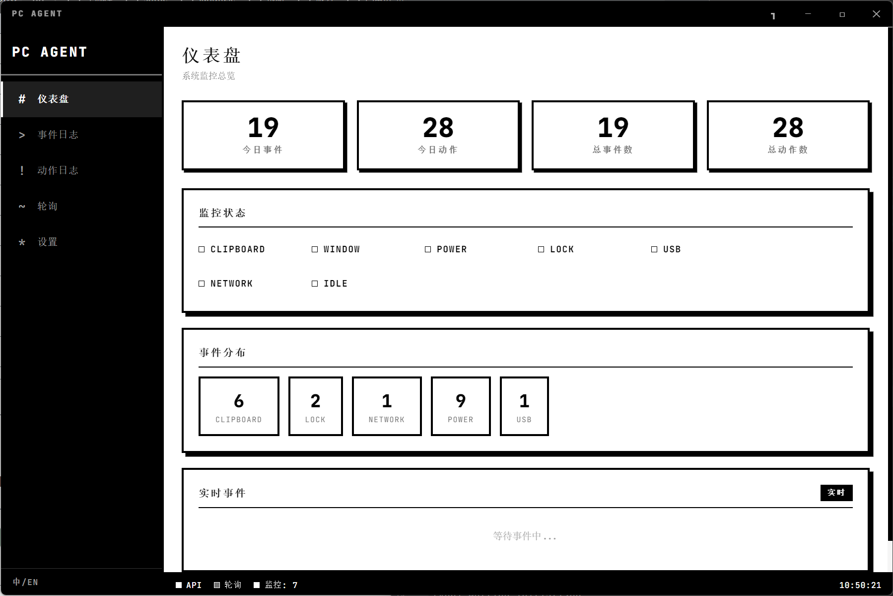
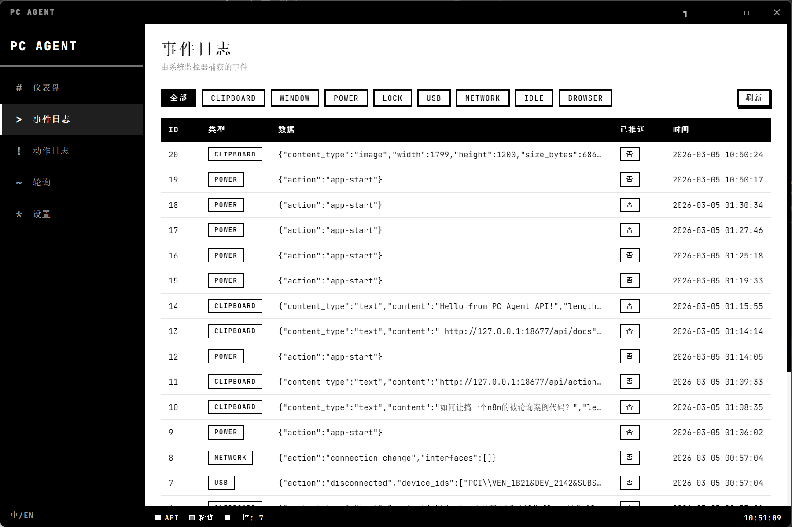
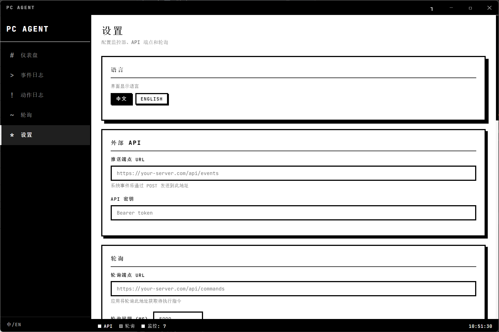
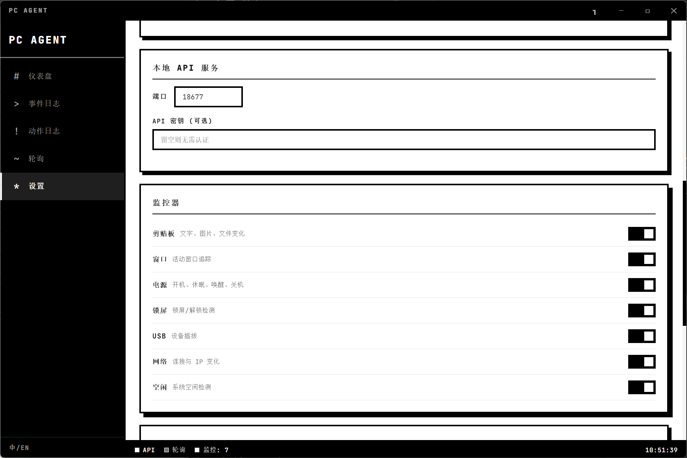
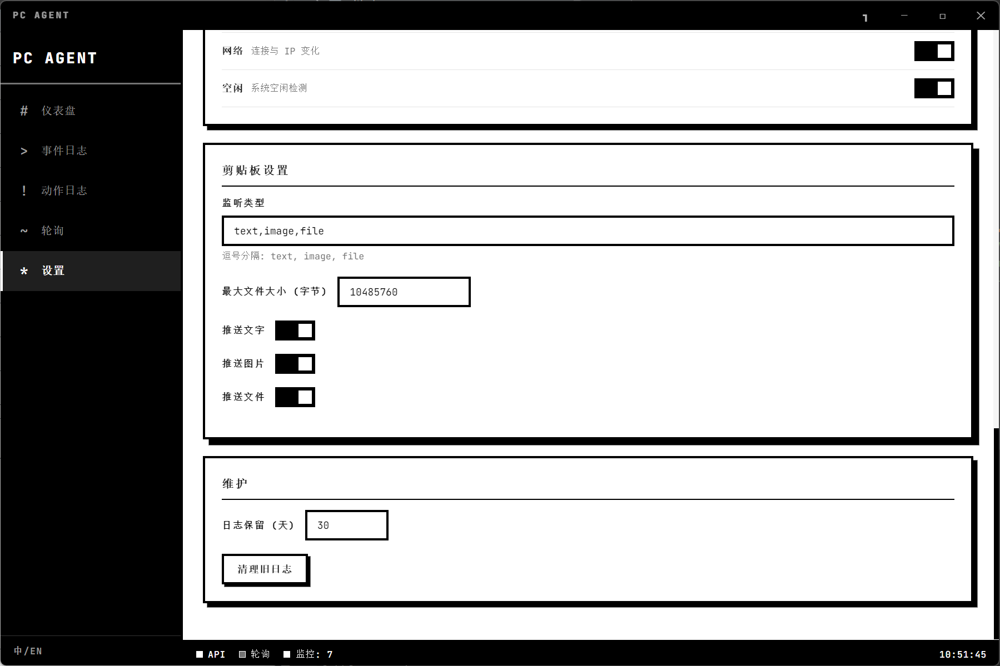
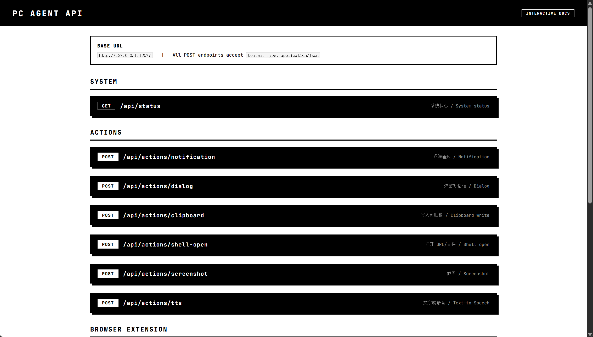
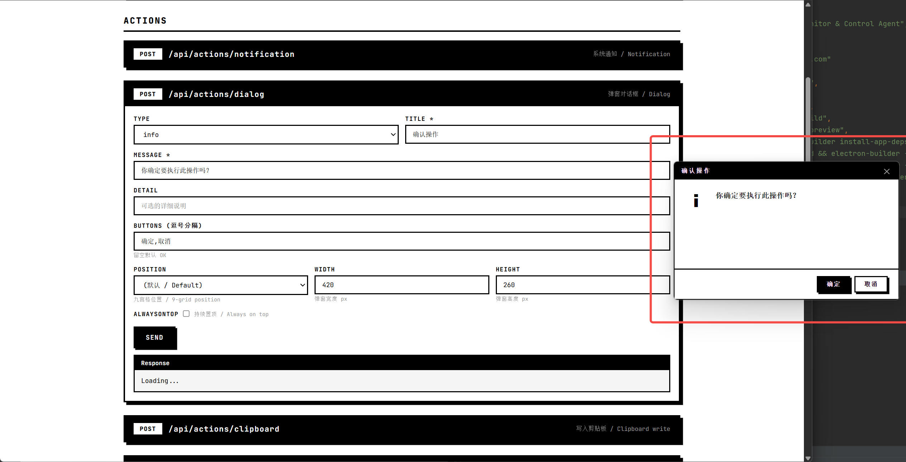

# PC Agent

[中文文档](README.zh-CN.md) | English

> Desktop system monitor & control agent — Neo-Brutalist black/white theme

PC Agent is an Electron-based desktop agent that monitors PC system events and triggers actions via a local REST API. Designed for integration with automation platforms like n8n for remote PC control and event pushing.



---

## Features

### System Monitors

| Monitor | Description |
|---------|-------------|
| **Clipboard** | Text, image, file changes with type/size filters |
| **Window** | Active window tracking (title, process) |
| **Power** | Boot, sleep, resume, shutdown |
| **Lock Screen** | Lock / unlock detection |
| **USB** | Device plug / unplug |
| **Network** | Connection & IP changes |
| **Idle** | System idle detection |

### Local REST API

Built-in Express server on `127.0.0.1:18677` with interactive docs at `/api/docs`.

| Endpoint | Action |
|----------|--------|
| `POST /api/actions/notification` | System notification |
| `POST /api/actions/dialog` | Custom dialog (9-grid position, always-on-top) |
| `POST /api/actions/clipboard` | Write to clipboard |
| `POST /api/actions/shell-open` | Open URL / file |
| `POST /api/actions/screenshot` | Capture screen (base64 PNG) |
| `POST /api/actions/tts` | Text-to-Speech |
| `GET /api/status` | System & monitor status |
| `POST /api/browser/command` | Browser extension command |

### Polling Engine

Polls an external service for commands and executes them via the local API. Perfect for n8n webhook integration — no inbound network access required.

### Browser Extension

Chrome Manifest V3 extension for bidirectional browser control: open/close tabs, navigate, execute scripts, get page info, capture screenshots.

### i18n

Full Chinese / English bilingual support, switchable in settings.

---

## Screenshots

<table>
<tr>
<td></td>
<td></td>
</tr>
<tr>
<td align="center"><b>Dashboard</b> — stats, monitors, live events</td>
<td align="center"><b>Event Log</b> — filterable event history</td>
</tr>
<tr>
<td></td>
<td></td>
</tr>
<tr>
<td align="center"><b>Settings</b> — language, external API</td>
<td align="center"><b>Settings</b> — API server, monitors toggle</td>
</tr>
<tr>
<td></td>
<td></td>
</tr>
<tr>
<td align="center"><b>Settings</b> — clipboard filters, maintenance</td>
<td align="center"><b>API Docs</b> — interactive test page</td>
</tr>
<tr>
<td colspan="2"></td>
</tr>
<tr>
<td colspan="2" align="center"><b>Dialog API</b> — custom brutalist dialog with position control</td>
</tr>
</table>

---

## Quick Start

### Prerequisites

- Node.js >= 20
- npm

### Install & Dev

```bash
npm install
npm run dev
```

### Build

```bash
# Windows
npm run build:win

# macOS
npm run build:mac

# Linux
npm run build:linux
```

---

## API Usage

### Base URL

```
http://127.0.0.1:18677
```

All POST endpoints accept `Content-Type: application/json`.

### Notification

```bash
curl -X POST http://127.0.0.1:18677/api/actions/notification \
  -H "Content-Type: application/json" \
  -d '{"title": "Hello", "body": "From PC Agent"}'
```

### Dialog (with position & always-on-top)

```bash
curl -X POST http://127.0.0.1:18677/api/actions/dialog \
  -H "Content-Type: application/json" \
  -d '{
    "type": "info",
    "title": "Reminder",
    "message": "Task completed",
    "buttons": ["OK", "Cancel"],
    "position": "bottom-right",
    "alwaysOnTop": true
  }'
```

**Position values:** `top-left` `top-center` `top-right` `center-left` `center` `center-right` `bottom-left` `bottom-center` `bottom-right`

### Screenshot

```bash
curl -X POST http://127.0.0.1:18677/api/actions/screenshot \
  -H "Content-Type: application/json" -d '{}'
```

### TTS

```bash
curl -X POST http://127.0.0.1:18677/api/actions/tts \
  -H "Content-Type: application/json" \
  -d '{"text": "Hello World", "rate": 1.0}'
```

### Interactive Docs

Open `http://127.0.0.1:18677/api/docs` in your browser for a full interactive API test page.

---

## n8n Integration

PC Agent is designed for polling-based integration — the app polls your n8n webhook for commands, so no inbound ports need to be opened.

### Polling Response Format

Your external service should return:

```json
{
  "commands": [
    { "action": "notification", "data": { "title": "Hello", "body": "From n8n" } },
    { "action": "tts", "data": { "text": "Task completed" } }
  ]
}
```

See [examples/](examples/) for a complete n8n workflow JSON.

---

## Browser Extension

1. Open `chrome://extensions/` → Enable Developer Mode
2. Click "Load unpacked" → Select the `browser-extension/` folder
3. The extension connects to `127.0.0.1:18677` automatically

Supported commands: `open-tab` `close-tab` `navigate` `get-page-info` `get-tabs` `execute-script` `get-selection` `screenshot`

---

## Release

Releases are built automatically via GitHub Actions when a version tag is pushed:

```bash
git tag v1.0.0
git push origin v1.0.0
```

This triggers builds for Windows (.exe), macOS (.dmg), and Linux (.AppImage, .deb), then creates a GitHub Release with all artifacts.

---

## Tech Stack

| Layer | Technology |
|-------|-----------|
| Framework | Electron 33 + electron-vite |
| Frontend | Vue 3 (Composition API) + Vue Router |
| Backend | Express 4 (local API server) |
| Database | SQLite (better-sqlite3, WAL mode) |
| Language | TypeScript |
| Theme | Neo-Brutalist (black/white, 3px borders, hard shadows, monospace) |
| Build | electron-builder |

## License

MIT
